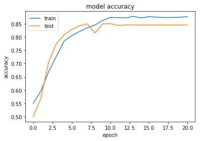
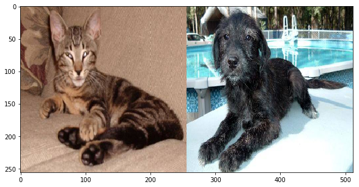
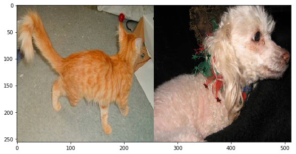
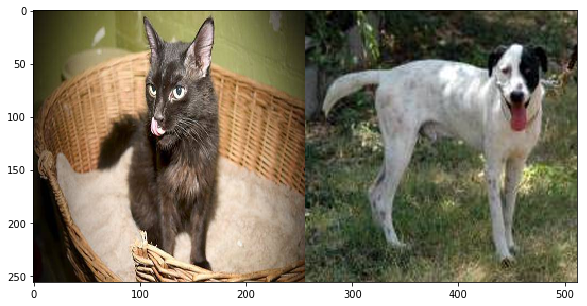
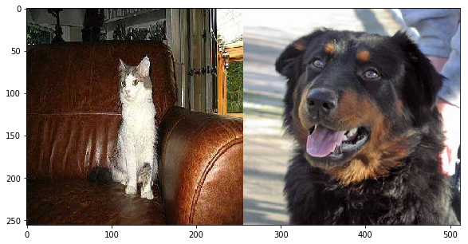

# Cats-Vs-Dogs-CNN-using-Keras-

#### The training set consisted of 25,000 images out of which 5,000 images were taken out as validation data. Separate test data folder consisted of 12,500 images for which the labels were predicted using trained model. My work includes preprocessing for model, Data augmentation to prevent overfitting, callbacks in keras to reduce learning rate timely, various CNN architecture trials with different layers and hyperparameters for best fit and learning curve wrt epochs.

#### I gained a validation accuracy of 87.15 % without using any pretrained imagenet models . VGG-16 gave around 89 % as validation accuracy.
    
  
  
